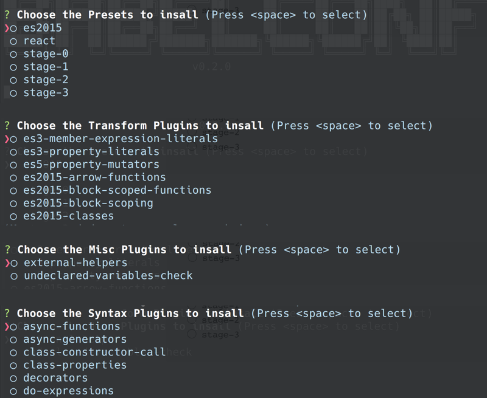

```
██████╗  █████╗ ██████╗ ███████╗██╗      ██████╗ ██████╗ ███╗   ██╗███████╗
██╔══██╗██╔══██╗██╔══██╗██╔════╝██║     ██╔════╝██╔═══██╗████╗  ██║██╔════╝
██████╔╝███████║██████╔╝█████╗  ██║     ██║     ██║   ██║██╔██╗ ██║█████╗
██╔══██╗██╔══██║██╔══██╗██╔══╝  ██║     ██║     ██║   ██║██║╚██╗██║██╔══╝
██████╔╝██║  ██║██████╔╝███████╗███████╗╚██████╗╚██████╔╝██║ ╚████║██║
╚═════╝ ╚═╝  ╚═╝╚═════╝ ╚══════╝╚══════╝ ╚═════╝ ╚═════╝ ╚═╝  ╚═══╝╚═╝
```

Create a `.babelrc` configuration quickly from the command line.
No need to remember plugin module names or their alternate configuration
option.

Babelconf uses the  to
keep its plugin listing up-to-date and subsequently supports and lists _all_
plugins.

### Features
- Select _any_ plugin listed on the [babeljs.io plugins listing](babeljs.io/docs/plugins/)
- **Updates** and **installs** `package.json` and installs selected plugins.
- **Updates** or **creates** `.babelrc` configuration (confirms merge, overwrite on update)

```
  $ > npm install -g babelconf
  $ > babelconf
```



### TODO: 
[ ] Support showing which plugins are installed when updating
